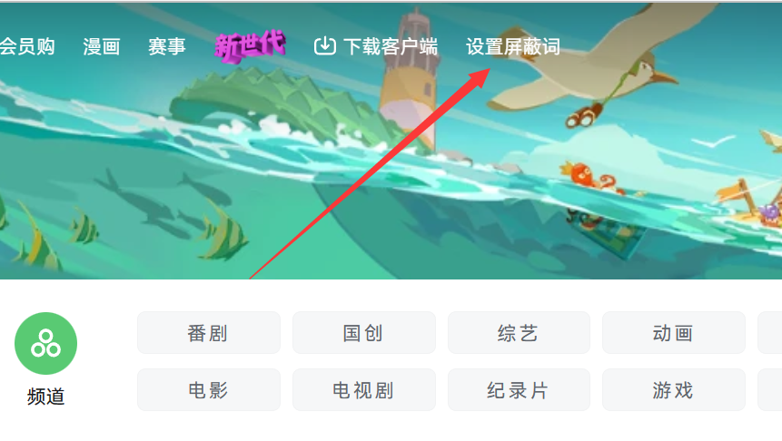
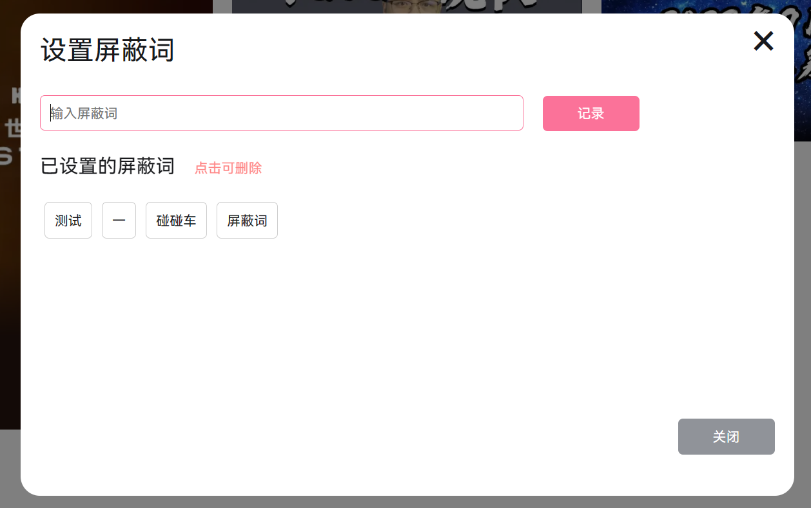

# bilibili-masked-words

## 插件简介

哔哩哔哩 B站 PC端 自己写的一个根据设置的屏蔽词屏蔽某些视频的油猴插件

更新 知乎标题关键词过滤器 使用方法同上

## 安装学习

此项目的inde.js 文件内容为插件代码，可自行复制进行安装学习

## 预览

## 设置屏蔽词

1. 打开 B站 PC 端网站。
2. 在右上角，你会看到一个名为 '设置屏蔽词' 的选项。
3. 点击 '设置屏蔽词'，会弹出一个窗口，让你输入要屏蔽的关键词。
4. 输入关键词后，点击 "记录" 或按下回车键，即可保存你的屏蔽词。
5. 插件会在页面变化时自动检查视频内容，以确保不显示包含屏蔽词的视频。
  
## 贡献

如果你想要为这个项目做出贡献，可以提供改进意见、报告问题或提交Pull Reques

## 免责声明

此项目仅用于个人编程练习和学习油猴脚本的目的。它不被用于任何商业、宣传、或恶意目的。作者不对使用本项目的个人或组织的行为负任何法律责任。

### 官方声明

请注意，根据 [哔哩哔哩弹幕网用户使用协议](https://www.bilibili.com/blackboard/account-useragreement.html)，某些类型的内容屏蔽或修改可能会违反B站的政策。作者不鼓励或支持违反B站政策的行为。

在使用本项目之前，请务必仔细阅读和遵守哔哩哔哩的相关政策和规定。作者不对因使用本项目而导致的违规行为承担任何责任。

### 法律警告

根据不同国家和地区的法律法规，可能会对某些类型的内容屏蔽或修改产生法律后果。在使用本项目之前，请确保你的行为符合适用法律。

如果你有任何法律疑虑或担忧，请在使用本项目之前咨询专业法律顾问。

